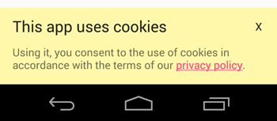

# CookiesConsent for Android

Android library to inform EU users of the use of cookies. The alert can be shown via dialog or an overlay view.




## Setup

Just add the dependency to your *gradle.build*
```groovy
compile 'com.github.carlosph:cookiesconsent:0.9.2'
```

## Usage

Simply create a new ```CookiesConsetDialog``` or ```CookiesConsetOverlay``` and call the method ```showIfApplies```.

To add a link to your privacy policy use the method ```setPolicyUrl(String policyUrl)```.

You only need to add one line to the **onCreate** method of your **MainActivity** to show the dialog or overlay to EU users when they open the app for the first time.

```java
new CookiesConsentDialog(this)
    .setPolicyUrl("https://github.com/Carlosph/CookiesConsent")
    .showIfApplies();
```

```java
new CookiesConsentOverlay(this)
    .setPolicyUrl("https://github.com/Carlosph/CookiesConsent")
    .showIfApplies();
```

## Languages
Supported languages:
* English
* Spanish
* French
 
There are just a few strings to be translated, so if your language is not supported, please help us by sending the translation.

You can send a pull request or just send me the strings, as you like. I will try to keep the library updated with the translations that I receive.

## Thanks

The code to detect if the user is from the European Union is from this [Stack Overflow question](http://stackoverflow.com/questions/31739347/android-eu-cookie-law), asked by [Mr.Betatester](http://stackoverflow.com/users/2235837/mr-betatester) and answered by [Ruyo](http://stackoverflow.com/users/5240952/ruyo).

## License

```
    Copyright 2015 Carlos Piñar Hafner

    Licensed under the Apache License, Version 2.0 (the "License");
    you may not use this file except in compliance with the License.
    You may obtain a copy of the License at

       http://www.apache.org/licenses/LICENSE-2.0

    Unless required by applicable law or agreed to in writing, software
    distributed under the License is distributed on an "AS IS" BASIS,
    WITHOUT WARRANTIES OR CONDITIONS OF ANY KIND, either express or implied.
    See the License for the specific language governing permissions and
    limitations under the License.
    
```
