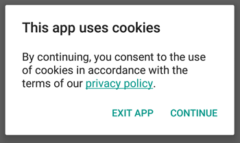

# CookiesConsent for Android

Android library to show a dialog informing of the use of cookies to the users on the EU.



## Setup

Just add the dependency to your *gradle.build*
```groovy
compile 'com.github.carlosph:cookiesconsent:0.9'
```

## Usage

Simply create a new ```CookiesConsetDialog``` and call it's method ```showIfApplies()```.

To add a link to your privacy policy use the method ```setPolicyUrl(String policyUrl)```, and to set it as cancelable you can use ```setCancelable(boolean cancelable)```.

As an example, adding this line to the **onCreate** method of your **MainActivity** will show the dialog the firs time an user on the EU opens the app.
```java
new CookiesConsentDialog(this).setPolicyUrl("https://github.com/Carlosph/CookiesConsent").showIfApplies();
```

## Thanks

The code to detect if the user is from the European Union is from this [Stack Overflow question](http://stackoverflow.com/questions/31739347/android-eu-cookie-law), asked by [Mr.Betatester](http://stackoverflow.com/users/2235837/mr-betatester) and answered by [Ruyo](http://stackoverflow.com/users/5240952/ruyo).

## License

```
    Copyright 2015 Carlos Piñar Hafner

    Licensed under the Apache License, Version 2.0 (the "License");
    you may not use this file except in compliance with the License.
    You may obtain a copy of the License at

       http://www.apache.org/licenses/LICENSE-2.0

    Unless required by applicable law or agreed to in writing, software
    distributed under the License is distributed on an "AS IS" BASIS,
    WITHOUT WARRANTIES OR CONDITIONS OF ANY KIND, either express or implied.
    See the License for the specific language governing permissions and
    limitations under the License.
    
```
